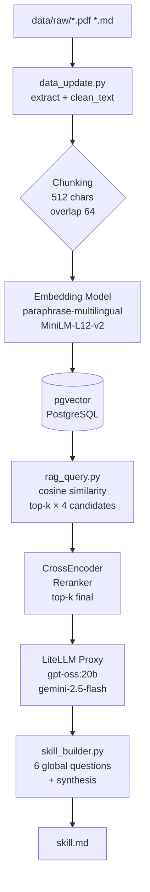

# HW3 — Decentralized Federated Learning RAG System

## 1. 專案簡介

### 知識主題

分散式聯邦學習聚合為主要焦點

選擇理由：這是我大學的專題並延伸作為我的碩論研究方向。

### 資料來源規模

| 指標 | 數值 |
|------|------|
| 文件總數 | 20 份（處理後 20 個 `.txt`） |
| 格式 | PDF（11 份）＋ Markdown（9 份） |
| 時間範圍 | 約 2019–2024 年學術論文 |
| 語言 | 英文 |

涵蓋子主題：去中心化 FL 綜述、安全與隱私、通訊優化、聚合策略、邊緣計算、群體學習（Swarm Learning）等。

### 系統架構與技術選型

| 元件 | 選擇 |
|------|------|
| 文字清理 | 自訂 `clean_text()`（去 HTML、NUL bytes、多餘空白） |
| Chunking | 固定長度 512 字元，overlap 64 |
| Embedding | `sentence-transformers/paraphrase-multilingual-MiniLM-L12-v2`（本地） |
| Reranking | `cross-encoder/ms-marco-MiniLM-L-6-v2` |
| Vector DB | pgvector（PostgreSQL 擴充） |
| LLM 接入 | LiteLLM 透過課程提供的 Proxy（支援 `gpt-oss:20b`、`gemini-2.5-flash`） |
| 冪等性 | mtime-based state file（`.file_state.json`） |

---

## 2. 系統架構說明



**資料流說明：**

1. `data_update.py` 讀取 `data/raw/` 中的 PDF / Markdown，清理文字後寫入 `data/processed/`
2. 清理後的文字切成固定長度 chunk，以 sentence-transformers 在本地 embedding
3. 向量與 metadata 寫入 pgvector
4. 查詢時先用 cosine similarity 取出 top-k×4 候選，再用 CrossEncoder rerank 取最終 top-k
5. 組合 prompt（system + context + question）送給 LiteLLM Proxy
6. `skill_builder.py` 以 6 個預設全域問題反覆呼叫 RAG pipeline，再 synthesize 成 `skill.md`

---

## 3. 設計決策說明

### Chunking 策略

- **方式**：固定字元長度切分，`CHUNK_SIZE = 512`，`CHUNK_OVERLAP = 64`
- **理由**：學術論文段落長度差異大，語意邊界切分需要額外 NLP 工具；固定長度實作簡單、可控且對 embedding 模型友好（避免超過 token 上限）。
- **Overlap 設定為 64 字元**：約佔 chunk 的 12.5%，足以保留跨 chunk 邊界的語意連結（如定義句跨行），又不會過度重複造成索引膨脹。
- **取捨**：固定長度可能在段落中間截斷，未來可改用段落或句子邊界切分（如 `nltk.sent_tokenize`）提升語意完整性。

### Embedding 模型選擇

- **選用**：`paraphrase-multilingual-MiniLM-L12-v2`（sentence-transformers，本地執行）
- **理由**：
  - 模型名稱含「multilingual」，支援 50+ 語言，雖然本知識庫以英文為主，但支援中文查詢（使用者以中文提問）映射到英文語意空間。
  - MiniLM-L12 大小約 118 MB，在 CPU 上推論速度合理，不需 GPU。
  - 輸出向量維度 384，與 pgvector 預設 schema 一致。
- **本地 vs API**：選擇本地模型（sentence-transformers）避免 API 費用與網路延遲，且不需 token；缺點是首次需下載模型檔（約 420 MB）。

### Vector DB 選型

- **選用**：pgvector（PostgreSQL 16 擴充）
- **理由**：
  - 與關聯式資料庫整合，方便未來擴充 metadata 篩選（如 `WHERE source LIKE 'Decentralized%'`）。
  - 原生支援 cosine / L2 / inner product 距離，SQL 語法操作直觀。
  - 以 Docker 啟動，環境隔離性佳。
- **評估過的替代方案**：ChromaDB 無需 server，適合原型開發；但 pgvector 在生產環境更穩定，且已有現成 `docker-compose.yml`。

### Retrieval 策略

- **兩階段 Retrieval + Rerank**：
  1. pgvector cosine similarity 取 `top_k × 4`（預設 20）個候選
  2. CrossEncoder（`cross-encoder/ms-marco-MiniLM-L-6-v2`）精排，取最終 `top_k`（預設 5）
- **理由**：Bi-encoder（embedding similarity）速度快但準確度有限；CrossEncoder 對 query-passage pair 做 full attention，準確度高但速度慢。兩階段結合兼顧效率與品質。
- **top-k = 5**：平衡 context 長度（5 × 512 chars ≈ 2560 chars）與 LLM token 上限。

### Prompt Engineering

RAG prompt 結構（`build_messages()` in `rag_query.py`）：

```
[system]
You are a helpful research assistant.
Answer the user's question using ONLY the context provided below.
If the answer is not in the context, say so clearly.

[user]
Context:
[1] (source: <stem>, chunk #<n>)
<text>

[2] (source: <stem>, chunk #<n>)
<text>
...

Question: <user question>
```

- **來源標註**：每個 context chunk 前加 `[i] (source: ..., chunk #...)` 格式，讓 LLM 知道來源位置，也讓 `show_sources()` 能列出引用。
- **嚴格限制**：系統 prompt 明確要求 LLM「只用提供的 context 回答」，降低幻覺。

### Idempotency 設計

`data_update.py` 透過 `.file_state.json` 實現冪等性：

- **機制**：以 `raw_path.stat().st_mtime`（檔案修改時間）為 key，記錄已處理的 stem → mtime 對應表。
- **判斷邏輯**：若 state 中 stem 的 mtime 未變且 processed 檔案存在 → skip；否則重新處理。
- **`--rebuild` 模式**：刪除所有 processed 檔案、清空 state、重建整個 pgvector table。
- **好處**：多次執行不會重複寫入資料庫，只有真正更新的檔案才會觸發 embedding 與 DB 寫入。

### skill_builder.py 問題設計

設計 6 個全域問題，對應 skill.md 的不同章節：

| key | 目的 |
|-----|------|
| `core_concepts` | 萃取核心概念與術語，建立知識地圖 |
| `key_trends` | 找出現行研究方向與新興議題 |
| `key_entities` | 識別重要作者、機構、工具、資料集 |
| `methodology` | 提取被廣泛採用的方法與最佳實務 |
| `gaps` | 揭示知識空白與未解問題（對使用者最有價值） |
| `example_qa` | 生成示範 Q&A，讓使用者了解系統能回答的問題類型 |

以上 6 個問題的答案最終送給 LLM 做 synthesis，生成不超過 200 字的知識庫概覽段落，再組合成完整 `skill.md`。

---

## 4. 環境設定與執行方式

### 4-1. Python 版本與虛擬環境

本專案開發使用 **Python 3.9.6**，pyproject.toml 要求 `>= 3.9`。

```bash
# ① 確認 Python 版本
python3 --version        # 需顯示 >= 3.9.x

# ② 建立並啟動虛擬環境
python3 -m venv .venv
source .venv/bin/activate        # Linux / macOS
# .venv\Scripts\activate         # Windows

# 啟動後提示符會出現 (.venv) 前綴

# ③ 安裝套件
pip install -r requirements.txt
```

### 4-2. Vector DB 啟動

本專案使用 **pgvector**（需要 Docker）。

```bash
# ④ 啟動 pgvector
docker compose up -d

# 確認啟動成功（Status 應為 running / healthy）
docker compose ps
```

> `docker-compose.yml` 使用具名 volume，確保跨機器可複現。

### 4-3. 環境變數設定

```bash
# ⑤ 複製範本並填入金鑰
cp .env.example .env
```

開啟 `.env`，填入以下必要欄位：

```
LITELLM_API_KEY=<助教提供的 API Key>
LITELLM_BASE_URL=https://litellm.netdb.csie.ncku.edu.tw
OPENAI_API_KEY=<有 gemini-2.5-flash 存取權限的 Key，若只用 gpt-oss:20b 可與上方相同>
```

其餘欄位（Embedding、pgvector 連線字串）保持預設值即可。

### 4-4. 完整執行流程

```bash
# ① 確認 Python 版本
python3 --version        # 需顯示 >= 3.9.x

# ② 建立並啟動虛擬環境
python3 -m venv .venv
source .venv/bin/activate

# ③ 安裝套件
pip install -r requirements.txt

# ④ 設定環境變數
cp .env.example .env
# 編輯 .env，填入 LITELLM_API_KEY 和 LITELLM_BASE_URL

# ⑤ 啟動 Vector DB
docker compose up -d
docker compose ps        # 確認 pgvector 狀態為 running

# ⑥ 全量重建索引（首次執行或資料有更新時）
python data_update.py --rebuild

# ⑦ 測試 RAG 問答
python rag_query.py --query "What are the main challenges in decentralized federated learning?"

# ⑧ 生成 Skill 文件
python skill_builder.py --output skill.md

# 可選：使用 Gemini 模型
python skill_builder.py --model gemini-2.5-flash --output skill.md
```

---

## 5. 資料來源聲明

| 來源 | 類型 | 授權/合規依據 | 數量 |
| --- | --- | --- | --- |
| arXiv 論文 | PDF | CC BY 4.0 | 4 |
| arXiv 論文 | PDF |  arXiv Non-exclusive Dist. 1.0 | 3 |
| arXiv 論文 | PDF | CC BY-NC-SA 4.0 | 1 |
| IEEE 論文 | PDF | CC BY 4.0 | 3 |
| 個人筆記 | MarkDown | 個人著作 | 9 |

---

## 6. 系統限制與未來改進

### 目前限制

1. **Chunking 語意不完整**：固定字元切分可能在句子或段落中間截斷，影響 chunk 語意完整性，進而降低 retrieval 精度。

2. **Embedding 模型未針對學術領域優化**：`paraphrase-multilingual-MiniLM-L12-v2` 是通用語意模型，未針對 ML / 聯邦學習領域術語特別訓練，對高度專業術語（如 "gossip protocol", "Byzantine tolerance"）的語意距離計算可能不夠精確。

3. **無 metadata 過濾**：目前 retrieval 只用向量相似度，無法根據文件來源、年份等 metadata 過濾，所有文件都同等權重參與檢索。

4. **CrossEncoder 模型載入效率**：每次查詢都重新載入 CrossEncoder 模型，在互動模式下多輪對話性能較差。

5. **Reranker 語言對齊問題**：`ms-marco-MiniLM-L-6-v2` 是英文訓練的 reranker，若使用者以中文查詢，中英文語意對齊可能有落差。

### 未來改進方向

1. **改用語意邊界切分**（如段落、句子），搭配 `nltk` 或 `spaCy`，提升 chunk 語意完整性。
2. **引入 metadata 索引**（年份、主題標籤），支援條件過濾（`WHERE year >= 2022`）。
3. **模型快取**：在互動模式中快取 CrossEncoder instance，避免每次重新載入。
4. **HyDE（Hypothetical Document Embedding）**：生成假設性文件再做 embedding，提升對專業術語查詢的 recall。
5. **評估框架**：引入 RAGAS 或 TruLens，量化 faithfulness、answer relevancy、context recall 等指標。
